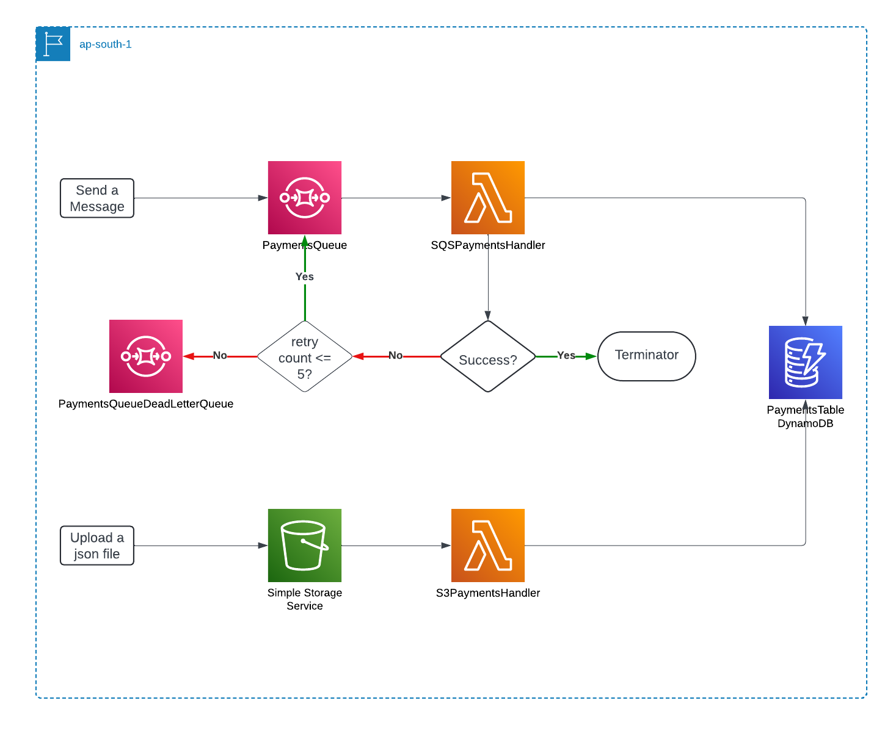

<!--
title: 'AWS NodeJS Example'
description: 'This template demonstrates how to deploy a NodeJS function running on AWS Lambda using the traditional Serverless Framework.'
layout: Doc
framework: v3
platform: AWS
language: nodeJS
priority: 1
authorLink: 'https://github.com/serverless'
authorName: 'Serverless, inc.'
authorAvatar: 'https://avatars1.githubusercontent.com/u/13742415?s=200&v=4'
-->


# Payment Manager Serverless Application

This is a serverless application using the AWS ecosystem and the Serverless Framework that processes events from S3 and SQS, transforms the data, and stores the results in a DynamoDB.

### Deployment

In order to deploy the application, you need to run the following command:

```
$ serverless deploy
```

### Invocation

1. Send a message to payments.fifo queue from AWS console. An example message can be found in sample.json file
2. Upload a json file to all-payments S3 bucket. An example json file is sample.json file
3. The aggreagated data can be found in Payments DynamoDB
4. Access payment-manager-dev-SQSPaymentsHandler and payment-manager-dev-S3PaymentsHandler cloudwatch log groups for monitoring the logs. 


### Architecture

## Decisions
1. Implemented the redrive policy to retry processing the messages published to SQS and eventually persist the failed messages in the dead letter queue.
2. Used a FIFO queue to maintain the order of the received messages.
3. Returned the batch failure items after processing the SQS events to avoid processing the successful events again.
4. Introduced environment variables to Lambda functions to avoid deployments when changing the variable values.


